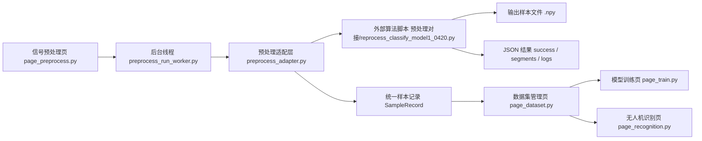

# 预处理接入结构图

## 1. 当前接入链路

## 2. 每一层的职责

### 信号预处理页

负责：

- 选择 `.cap` 文件
- 读取头信息
- 显示分析带宽、实际采样率、中心频率
- 收集用户参数
- 展示处理日志和结果表

不负责：

- 直接 import 并硬编码调用外部算法细节
- 直接管理样本入库

### 后台线程

负责：

- 把预处理执行放到 `QThread` 中
- 避免 Qt 主界面卡死
- 把完成/失败结果发回页面

### 预处理适配层

负责：

- 按路径动态加载同学的算法脚本
- 统一前端输入参数
- 调用 `run_inference_api(...)`
- 校验返回 JSON 结构
- 把结果转换成项目内部统一的 `SampleRecord`

### 外部算法脚本

负责：

- 解析 `.cap`
- 执行无人机信号筛选
- 执行模型判别
- 输出样本文件
- 返回 `segments` 和 `logs`

### 数据集管理页

负责：

- 接收预处理输出样本记录
- 维护映射关系
- 自动标注与人工复核
- 生成数据集版本

## 3. 当前 CAP 联调口径

当前试跑口径如下：

- 头长按 `0x200 / 512` 字节
- `0x0010` 读取分析带宽
- 实际采样率按 `bandwidth_hz * 1.28`
- `0x0018` 读取中心频率
- IQ 从 `0x200` 后开始按大端 `int16` 交织读取

## 4. 如何判断接入成功

至少满足以下 4 条：

1. 预处理页能成功读取 `IQ_2025_01_09_13_55_30.cap` 的头信息  
   页面应显示：
   - 分析带宽 `10 MHz`
   - 实际采样率 `12.8 MHz`
   - 中心频率 `1090 MHz`

2. 点击“开始预处理”后，界面不冻结  
   说明后台线程生效。

3. 页面能正常显示算法返回结果  
   包括：
   - `message`
   - `detected_segment_count`
   - `output_sample_count`
   - `logs`
   - `segments`

4. 如果算法检出到有效片段  
   那么：
   - 输出目录下应出现真实 `.npy` 样本文件
   - 这些样本会被整理成 `SampleRecord`
   - 数据集管理页可继续看到这些新样本

## 5. 当前现状说明

当前已经接通的是：

- 页面 -> 线程 -> 适配层 -> 算法脚本 -> 返回 JSON -> 页面展示

当前还需要继续验证的是：

- `0x200` 头长是否最终成立
- 在你们自己的无人机 `.cap` 上能否稳定检出有效信号段
- 检出后的样本是否满足后续训练使用要求
